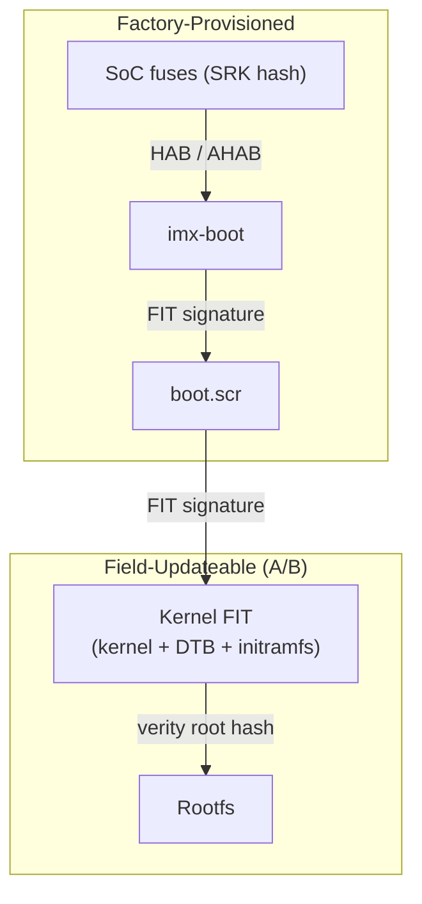

Shipping a production embedded Linux product on an NXP i.MX board eventually leads to the same question: _how do we update these devices in the field without bricking them?_ If the product is going to live for five, ten, or fifteen years, the answer needs to be more robust than “SSH in and run `apt upgrade`.” For devices that cannot afford to brick under any circumstances, the established answer is _A/B system updates_: two copies of the system on separate partitions, a bootloader that picks between them, atomic switchover, and automatic rollback if the new copy does not come up cleanly.

This article is a **practical, technically detailed walk-through of how to build A/B system updates for NXP i.MX boards**. The approach is generic across the i.MX 8, 8M, and 9 families; we have validated it end-to-end on the [NXP FRDM-IMX91](https://www.nxp.com/design/design-center/development-boards-and-designs/FRDM-IMX91). Along the way, we cover partition layout, U-Boot configuration, A/B version selection from the bootloader, signed FIT images for verified boot, and dm-verity for runtime rootfs integrity, all the way up to how these pieces plug into a `meta-imx` build. By the end, you'll have a reference design that updates atomically, rolls back on failure, and cryptographically verifies boot artifacts and rootfs blocks, ready to drive with [Rugix Ctrl](https://rugix.org/docs/ctrl/) or any other update engine.

<!-- truncate -->

:::tip
A complete, working reference of everything covered here, targeting the FRDM-IMX91 on Yocto Scarthgap, is available in [`meta-rugix`](https://github.com/rugix/meta-rugix) on GitHub.
:::

## Background

Before we get to the mechanics, let's start with a short primer on what an A/B update actually is and how the i.MX boot chain is structured. If you are already comfortable with both, feel free to skip ahead to [designing the A/B mechanism](#designing-the-ab-mechanism).

### A/B System Updates

A/B updates are the gold standard for robust system updates on embedded Linux devices that must not brick under any circumstances. The device keeps room for two versions of its bootable system — call them A and B — on separate partitions. At any point, one version is active (the running system) and the other is inactive. An update is installed as the inactive version while the active system keeps doing its job. After installation, the bootloader is instructed to boot the newly installed version. If the new system fails to boot or does not pass a health check, the bootloader automatically falls back to the previous version. A power loss during installation simply leaves the inactive version incomplete, and the device continues booting the active version as before.

This makes updates _atomic_. “Atomic” here means that at any point during an update, if the power fails or the network drops, the device is still bootable from the previously active version. No partially-written kernel, no unbootable DTB. The trade-off is storage, roughly twice the space for everything we duplicate, but in exchange we get a rollback path that does not require network access, a service call, or even a working userspace. For most production embedded Linux products, that trade is easy to justify.

### The i.MX Boot Chain

The i.MX BootROM loads a single container image called `imx-boot`, typically from offset 32 KiB on SD or eMMC (33 KiB on i.MX 8M Mini). That container holds the Secondary Program Loader (SPL), U-Boot proper, ARM Trusted Firmware, and DDR training blobs. U-Boot then loads and boots the kernel, the device tree, and the initramfs, which in turn mounts the root filesystem. Everything a field update might want to replace, the kernel, DTB, initramfs, and rootfs, sits _above_ U-Boot in this chain. Everything _below_ U-Boot is typically installed once at the factory and never touched again in the field.

**Applied to i.MX, A/B updates therefore duplicate and atomically switch the kernel, DTB, initramfs, and rootfs, while keeping `imx-boot` and U-Boot itself out of the regular update path.** Keeping `imx-boot` out of the update path is not really a choice: it lives at a fixed raw offset loaded directly by the BootROM, so it cannot be updated atomically, and non-atomic updates of a boot-critical artifact are not something we want to do in production as part of regular updates.

## Designing the A/B Mechanism

With the background out of the way, let's turn to the design of the A/B mechanism. A plain A/B mechanism is conceptually simple: keep two copies of the system, track which one is active, and have the bootloader switch between them. In this article, however, we want to follow current best practice for production embedded Linux devices and pair A/B updates with a **verified boot chain** — a cryptographic chain of trust that runs from the SoC-rooted signature on `imx-boot` all the way down to every block of the running rootfs, guaranteeing that the device only runs what we have authorized.

### Verified Boot Chain

Verified boot complicates things. Without it, kernel, DTB, and initramfs could just live inside the rootfs itself — U-Boot can load them straight from ext4, no separate boot partition needed. With it, we have to package the boot artifacts into a signed container U-Boot can verify before booting, extend runtime integrity down to every rootfs block, and make sure nothing the bootloader reads from disk opens a signing gap. The easiest way to see how the design falls out of this is to walk the chain of trust from the SoC outward and, at each link, ask what it forces on us and how A/B updates fit into it.

The verified boot chain has four links — sketched below, top to bottom from the SoC outward. The rest of this section walks them in order.



**The trust anchor: `imx-boot` signed against SoC fuses.** The trust chain has to start somewhere. On i.MX, that is the fuses: NXP's HAB (i.MX 6/7/8) and AHAB (i.MX 9, 8ULP) let us sign `imx-boot` against a key whose hash is permanently fused into the SoC as part of provisioning, and the BootROM checks that signature before handing control to SPL and then U-Boot. As we saw earlier, `imx-boot` itself stays out of the regular A/B update path, which means this first link of the chain is effectively immutable after provisioning and thus doesn't require any special handling for A/B updates.

**From U-Boot to a signed boot script.** U-Boot has a job to do before it can boot the Linux system: it has to pick which version (A or B) to run. That decision depends on state the device has persisted from previous boots, such as which version is currently the default and whether a newly installed version is being tried before it is committed as the new default. We put that logic in a small U-Boot boot script and wrap it in a signed [Flattened Image Tree (FIT)](https://fitspec.osfw.foundation/). A FIT is U-Boot's standard container format for signed payloads: a single file that carries one or more _images_ alongside a signature U-Boot checks before using what is inside. U-Boot loads the FIT, verifies the signature, and only then executes the script. An unsigned script on a partition an attacker can write to would be the obvious way around the chain; wrapping it in a signed FIT closes that route.

**From the boot script to the kernel: another signed FIT per version.** Having chosen a version, the boot script needs to load that version's kernel, device tree, and initramfs. As with the boot script itself, we have to ensure that they are properly signed in order to not break the trust chain. To this end, we also package them all together in a single signed FIT. Note that each image in the FIT carries its own hash, enabling its independent verification, but a single signature on the FIT's _configuration node_ binds those hashes together. As a result, one signature check in U-Boot then covers the entire boot-artifact set at once and an attacker cannot mix-and-match artifacts from different versions. Each version (A and B) has its own respective FIT that resides on a dedicated partition (more on that later).

**From the kernel to the rootfs: dm-verity, anchored in the signed FIT.** With the FIT verified, U-Boot boots the kernel with the device tree and initramfs contained therein. The next step is mounting the root filesystem, and the trust chain has to extend to every byte of that filesystem. To this end, we use [dm-verity](https://docs.kernel.org/admin-guide/device-mapper/verity.html), which computes a [Merkle tree](https://en.wikipedia.org/wiki/Merkle_tree) over the rootfs at build time and validates every block on read against the tree's root hash at runtime. The only open question is: how is the root hash injected into the boot sequence? We do that by stamping it into the FIT's `bootargs` property at build time, so the hash resides inside the FIT artifact that U-Boot has already verified. The identifier of the partition holding the rootfs cannot be baked into the FIT as it depends on whether we are booting version A or B (each has its own rootfs partition) — so the boot script appends it to the bootargs at runtime. An attacker who tampers with the rootfs has to change the root hash to match, and changing the hash inside the FIT invalidates the FIT signature. Rootfs and boot artifacts of the same version are thereby cryptographically tied together.

### Partition Layout

The chain of trust determines most of the partition layout. Each version needs a _boot slot_ for its signed kernel FIT (wrapped in a FAT image so U-Boot can `fatload` just the FIT at boot) and a _system slot_ for its rootfs, with the dm-verity hash tree appended to the filesystem data. Two further partitions round out the layout: a shared _config partition_ and a _data partition_.

**The config partition** holds the `boot.scr` we introduced above, next to a tiny env file that persists which version is currently active and whether a newly installed version is being tried. The env file doesn't need to be signed: the most it can tell the bootloader is “run A” or “run B,” and whichever version the bootloader picks will still be FIT-verified. State selects among authorized versions; it cannot add unauthorized ones.

**The data partition** holds logs, databases, application data, and anything else that has to outlive a version switch. It belongs to neither version and sits explicitly outside the trust chain. Extending the trust chain to cover `data` is perfectly feasible — the initramfs can open it as a LUKS volume keyed by a per-device secret (e.g., derived from a TPM), giving authenticated encryption bound to the hardware — but the full integration goes beyond the scope of this article, and we will come back to it in a later one. Without that in place, anything on `data` that the running OS treats as privileged becomes a potential surface for a runtime attacker: if you use [Rugix Ctrl](https://rugix.org/docs/ctrl/) with its default state management, for instance, the rootfs overlay for runtime writes lives on `data` (it's discarded on every boot by default but may still provide a vector if data is manipulated at runtime).

The resulting partition layout has six partitions:

| #   | Name       | Contents                                    | Fixed size? |
| --- | ---------- | ------------------------------------------- | ----------- |
| 1   | `config`   | FAT; boot script and A/B state file         | 32 MiB      |
| 2   | `boot-a`   | FAT image containing the A kernel FIT       | e.g. 96 MiB |
| 3   | `boot-b`   | FAT image containing the B kernel FIT       | e.g. 96 MiB |
| 4   | `system-a` | ext4 root with dm-verity hash tree appended | e.g. 4 GiB  |
| 5   | `system-b` | ext4 root with dm-verity hash tree appended | e.g. 4 GiB  |
| 6   | `data`     | ext4 for persistent state                   | remainder   |

In addition, `imx-boot` is written at a fixed offset as discussed above.

A matching [WKS file](https://docs.yoctoproject.org/dev-manual/wic.html) for a Yocto build is short:

```wks
bootloader --ptable gpt

part --source rawcopy --sourceparams="file=imx-boot" --no-table --align ${IMX_BOOT_SEEK}
part --source bootimg-partition --fstype=vfat --align 8192 --fixed-size 32M
part --source rawcopy --sourceparams="file=${IMGDEPLOYDIR}/${IMAGE_LINK_NAME}.boot.img" --align 4096 --fixed-size 96M
part --align 4096 --fixed-size 96M
part --source rawcopy --sourceparams="file=${IMGDEPLOYDIR}/${IMAGE_LINK_NAME}.ext4.verity" --align 4096
```

The B slots (`boot-b`, `system-b`) and the `data` partition do not need any content in the factory image. A small bootstrapping step on first boot can grow the partition table and format `data`. This keeps the shipped factory image small and allows size-based filesystem creation heuristics to apply to the data partition based on the size of the disk.

### Update Installation

With the layout and the trust chain in place, an update itself works as follows. The update engine determines the inactive version, writes the new FIT to that version's boot slot and the new rootfs to that version's system slot. Neither write needs to be atomic on its own: a partial write just leaves the inactive slots in a dirty state, which is harmless because the active version — still the configured default — is unaffected. Once both writes have completed, the engine atomically updates a flag in the config partition's state file to say “try the inactive version on next boot” and reboots. On reboot, the signed boot script sees the flag, clears it, and boots the newly written version. If that version comes up healthy, userspace _commits_ the switch by updating the default to point at it; if anything fails along the way — a kernel panic, an expired watchdog, a failing health check — the next reboot falls back to the previously committed version. There is no half-written state to recover from and no dedicated repair procedure.

## Implementation

What follows walks through the major pieces of a concrete Yocto implementation of the design above, based on `meta-imx`: the U-Boot configuration, how the Yocto build produces the required FIT images, what the boot script does, how dm-verity is wired at build and runtime, how the signing integration ties everything together, and how the update engine drives the flow described above. The full wiring — U-Boot fragments, FIT recipes, boot script, dm-verity image class, signing integration — is available in the [`meta-rugix`](https://github.com/rugix/meta-rugix) reference layer.

### U-Boot Configuration

To make U-Boot behave correctly under the design above, we enable the following on top of the stock NXP U-Boot configuration:

```kconfig
# No compiled-in env storage. Auto-loading the U-Boot environment from
# disk would let an attacker with storage write access change bootcmd,
# bootargs, or any other variable and sidestep verified boot.
CONFIG_ENV_IS_NOWHERE=y
# CONFIG_ENV_IS_IN_MMC is not set
# CONFIG_ENV_IS_IN_FAT is not set
# CONFIG_ENV_IS_IN_SPI_FLASH is not set

# We still need a place to put A/B state. We keep it on the FAT config
# partition as a plain U-Boot env file that the boot script imports
# explicitly (and that userspace can read/write via libubootenv).
CONFIG_ENV_SIZE=0x4000
CONFIG_CMD_FAT=y
CONFIG_FAT_WRITE=y

# Kernel + DTB + initramfs are delivered as a single FIT; no legacy uImage.
CONFIG_FIT=y
# CONFIG_LEGACY_IMAGE_FORMAT is not set

# The boot script reads bootargs out of the FIT to pick up the per-version
# dm-verity root hash, so it needs `fdt get value`.
CONFIG_CMD_FDT=y

# Verify FIT signatures before using any signed payload (boot.scr and
# the kernel FIT). The matching public key is embedded in U-Boot's own
# device tree by the build system (see below).
CONFIG_FIT_SIGNATURE=y
CONFIG_RSA=y

# No autoboot prompt, hang on any boot failure. Together, these close
# the interactive-console backdoor: no keypress at boot lands in a
# U-Boot shell from which unsigned code could be loaded.
CONFIG_BOOTDELAY=-2
CONFIG_PANIC_HANG=y
```

:::warning
These changes are the minimum we need for verified boot and A/B switching. **For a production deployment, further hardening of the U-Boot configuration is strongly recommended** — disable any commands the device does not need (USB boot, network boot, raw memory access), strip debug-only features, and prune anything else that is not required for the actual boot path. What exactly to remove depends on the board and the threat model.
:::

### Building the Slot Images

The [WKS file from earlier](#partition-layout) references two artifacts that the Yocto build has to produce: the system slot image (the rootfs with its dm-verity hash tree) and the boot slot image (a FAT image wrapping the boot artifacts FIT). The boot slot image depends on the system slot image as the FIT it wraps has to carry the dm-verity root hash of the rootfs.

**The system slot image.** The `image_types_verity` class from `meta-oe` produces the verity image along with a small sidecar file describing the geometry (data block count, block size, salt, hash offset) and the root hash. You enable it by inheriting the class and adding `verity` to the image's filesystem types:

```bitbake
IMAGE_CLASSES:append = " image_types_verity"
IMAGE_FSTYPES:append = " ext4 verity"
```

**The kernel FIT.** Yocto's `kernel-fitimage` class knows how to package the kernel, DTB, and initramfs into the kernel FIT introduced above. Turning it on in an NXP-downstream-BSP configuration is a matter of flipping a handful of variables:

```bitbake
KERNEL_CLASSES:append = " kernel-fitimage"
KERNEL_IMAGETYPES = "fitImage"
INITRAMFS_IMAGE = "verity-initramfs"
INITRAMFS_IMAGE_BUNDLE = "0"

# Reserve padding so we can inject the dm-verity root hash at image time
# without having to rebuild and re-sign the FIT from scratch. 2000 bytes
# is plenty for a bootargs string.
UBOOT_MKIMAGE_DTCOPTS = "-I dts -O dtb -p 2000"
```

`INITRAMFS_IMAGE` points at the initramfs recipe covered in the next subsection; Yocto makes the kernel build depend on it, and `kernel-fitimage` embeds the resulting cpio into the FIT. The `-p 2000` bit is worth explaining: FIT images are flattened device trees, and `fdtput` can only add properties if the tree has free space at the end. By reserving 2 KiB of padding at build time, we can stamp in the dm-verity root hash at image-assembly time without reassembling the FIT from scratch.

**The initramfs.** We want a single portable image to boot from whichever storage medium the board happens to have, e.g., an SD on one unit and an eMMC on another. The kernel can bring up dm-verity directly, but it wants a device path which would have to be specific to a storage medium. A small initramfs gives us the flexibility to resolve the rootfs by `PARTUUID` (injected through the U-Boot boot script), `veritysetup open` against it, and then use the resulting dm-verity protected block device as root. It's also the natural place for anything else that has to happen before the rootfs is mounted (e.g., unlocking a LUKS-encrypted system partition with a TPM-bound key).

We keep the initramfs minimal. [`verity-initramfs.bb`](https://github.com/rugix/meta-rugix/blob/517abfbba4fb9a5d458a46c72840a8c757c5f49e/meta-rugix-nxp-imx-uboot/recipes-core/images/verity-initramfs.bb) ships only `initramfs-framework-base`, `initramfs-module-udev`, and a small custom [`verity` module](https://github.com/rugix/meta-rugix/blob/517abfbba4fb9a5d458a46c72840a8c757c5f49e/meta-rugix-nxp-imx-uboot/recipes-core/initrdscripts/files/verity) that reads the dm-verity parameters from `/proc/cmdline` and calls:

```sh
veritysetup open \
    --no-superblock \
    --data-block-size="$bootparam_rootblocksize" \
    --hash-block-size="$bootparam_rootblocksize" \
    --data-blocks="$bootparam_rootdatablocks" \
    --hash-offset="$bootparam_roothashoffset" \
    --salt="$bootparam_rootsalt" \
    "$root_dev" rootverity "$root_dev" "$bootparam_roothash"
```

The option `--no-superblock` matches how `image_types_verity` formats the hash tree. This is an added security measure as it specifies the entire geometry through signed parameters from the signed and verified FIT image.

**Enabling FIT signing.** Signing in the build is gated by `UBOOT_SIGN_ENABLE=1`. Pair it with `UBOOT_SIGN_KEYDIR` and `UBOOT_SIGN_KEYNAME` to configure the signing key, and the build signs every artifact in the chain that has to be signed (the kernel FIT and `boot.scr`) and embeds the matching public key into U-Boot's own device tree, so on-device `CONFIG_FIT_SIGNATURE` can verify them at `bootm` time. We don't cover key generation; any 2048-bit RSA key in the format U-Boot's `mkimage` expects works, and the [signed example in `meta-rugix`](https://github.com/rugix/meta-rugix/blob/517abfbba4fb9a5d458a46c72840a8c757c5f49e/examples/frdm-imx91-signed.yaml) shows a working configuration.

:::warning
**FIT signing on its own does not give you a rooted chain of trust, and it does not prevent rollback attacks.** Without HAB/AHAB signing of `imx-boot` against the SoC's fused SRK hashes, an attacker with storage write access can swap `imx-boot` for a U-Boot that has verification disabled, and the whole scheme collapses silently. And even with `imx-boot` signed, a signature only binds a FIT to a key — it says nothing about version ordering, so a previously-released (but still-signed) build with a known vulnerability can be reinstalled and booted. Preventing that needs a monotonic anti-rollback counter backed by SoC hardware or a TPM. Both topics are independent of A/B updates and we may cover them in separate articles.
:::

**The boot slot image.** Yocto's standard classes do not wrap the FIT in a FAT image or stitch the dm-verity root hash into it on their own. That job is handled by a small custom image class, [`fit-boot-img.bbclass`](https://github.com/rugix/meta-rugix/blob/517abfbba4fb9a5d458a46c72840a8c757c5f49e/meta-rugix-nxp-imx-uboot/classes/fit-boot-img.bbclass), which runs at image-assembly time and does three things. First, it reads the root hash and geometry from the verity image's sidecar and uses `fdtput -t s ${fit} / bootargs "..."` to inject them into the FIT's `bootargs` property (using the padding reserved above). Second, if `UBOOT_SIGN_ENABLE=1`, it re-signs the modified FIT — modifying `bootargs` would otherwise invalidate the signature U-Boot checks at `bootm`. Third, it sizes a FAT image to just fit the resulting FIT plus a bit of slack for the filesystem's own metadata, then copies the FIT into it as a single file:

```bash
mkfs.vfat -C -n BOOT boot.img <size-in-KiB>
mcopy -i boot.img fitImage ::fitImage
```

The result lands in `${IMGDEPLOYDIR}/${IMAGE_LINK_NAME}.boot.img`, where the WKS file picks it up. The dm-verity root hash and geometry now ride inside an artifact U-Boot signature-verifies at `bootm`; the kernel command line that surfaces it to userspace is assembled by the boot script at runtime.

### The Boot Script

The boot script (`boot.scr`) is loaded from the config partition by the BSP's distroboot mechanism and, with FIT signing enabled, verified by U-Boot before being executed. Its logic is small but load-bearing:

1. Import the persisted A/B state from `rugix.env` on the config partition.
2. If this is the first boot (no state file yet), default to version A.
3. If `rugix_boot_spare=1` (meaning the update engine just installed to the _other_ version and wants us to try it), swap to the other version and clear the flag. This is the trigger that makes the new system actually run.
4. Persist the updated state back to the config partition if it changed.
5. `fatload` the FIT from the selected version's boot slot.
6. Read `bootargs` out of the FIT (this carries the dm-verity root hash).
7. Append additional boot arguments (e.g., partition UUID and console).
8. `bootm` to extract the kernel, DTB, and initramfs from the FIT and boot.

The boot script is board-agnostic in two ways. First, all board-specific values come from U-Boot environment variables the boot process populates by the time our script runs: `${devnum}` is set by U-Boot's distroboot mechanism to the MMC device the script was loaded from (so it tells us whether we booted from SD or eMMC), `${console}` is set by NXP's u-boot-imx defconfig to the right serial UART for the board, and so on — the same `boot.scr` therefore covers the entire `imx-nxp-bsp` machine family. Second, the only state it imports from disk is the two A/B state keys (`rugix_bootpart`, `rugix_boot_spare`); everything else is set deterministically by the script itself.

Here is the core of the script:

```bash
# Load persisted A/B state. If the file does not exist (first boot),
# mark state dirty so defaults get written.
if load mmc ${devnum}:1 ${loadaddr} rugix.env; then
  env import -c ${loadaddr} ${filesize}
else
  setenv rugix_state_dirty 1
fi

if test -z "${rugix_bootpart}"; then
  setenv rugix_boot_spare 0
  setenv rugix_bootpart 2
  setenv rugix_state_dirty 1
fi

# rugix_boot_spare=1 means "try the other version". This is how the
# update engine hands control to the freshly-installed system.
if test "${rugix_boot_spare}" = "1"; then
  if test "${rugix_bootpart}" = "3"; then
    setenv rugix_boot_part 2
  else
    setenv rugix_boot_part 3
  fi
  setenv rugix_boot_spare 0
  setenv rugix_state_dirty 1
else
  setenv rugix_boot_part ${rugix_bootpart}
fi

setexpr rugix_sys_part ${rugix_boot_part} + 2

# Persist only if state actually changed.
if test -n "${rugix_state_dirty}"; then
  env export -c -s 0x4000 ${loadaddr} rugix_bootpart rugix_boot_spare
  fatwrite mmc ${devnum}:1 ${loadaddr} rugix.env 0x4000
fi

# Load the FIT from the active version's boot slot and extract the bootargs
# that were stamped in at build time (dm-verity root hash lives here).
setexpr fit_addr ${loadaddr} + 0x8000000
fatload mmc ${devnum}:${rugix_boot_part} ${fit_addr} fitImage
fdt addr ${fit_addr}
fdt get value fit_bootargs / bootargs

part uuid mmc ${devnum}:${rugix_sys_part} rugix_root_uuid

setenv bootargs ${fit_bootargs} root=PARTUUID=${rugix_root_uuid} \
    rootwait ro console=${console} panic=60

bootm ${fit_addr}
```

Note that **the boot script clears `rugix_boot_spare` before `bootm`-ing the spare version.** The new system gets exactly one attempt — userspace has to positively commit by updating `rugix_bootpart` to point at the new version for the switch to stick. If anything goes wrong before that commit — kernel panic, watchdog timeout, failed health check, application crash — the next reboot finds `rugix_boot_spare=0` and `rugix_bootpart` still pointing at the previous version, and the device boots the previous version. There is no boot counter, no retry policy in the bootloader; userspace owns the decision of what “healthy” means and has much better tooling to make it (systemd unit state, application probes, network reachability).

One subtlety worth flagging: the script reads `fit_bootargs` from the FIT _before_ `bootm` runs, so the value is extracted before any signature check. That looks like an injection vector — an attacker who tampered with the FIT could swap in a dm-verity root hash matching their own rootfs, and the script would happily pass it to the kernel. What makes this safe is that `bootm` itself verifies the FIT signature and refuses to start the kernel if it doesn't check out. A tampered FIT never gets booted, so the bootargs we extracted from it never reach a running kernel either.

### Applying an Update

The abstract update flow from earlier maps onto concrete on-device operations as follows:

1. The update engine fetches an update bundle, verifies its signature, and determines the inactive version (`B` if the device booted `A`, and vice versa).
2. It writes the new kernel FIT (wrapped in its FAT image) to the inactive version's boot slot (`boot-a` or `boot-b`) with a direct block-level write.
3. It writes the new rootfs (ext4 + hash tree) to the inactive version's system slot (`system-a` or `system-b`) with a direct block-level write.
4. It sets `rugix_boot_spare=1` in the config partition's env file using `fw_setenv`.
5. It triggers a reboot.
6. U-Boot loads `boot.scr`, verifies its signature, imports the env file, sees the spare flag, and boots the other version.
7. Userspace comes up under the new system. A health check (systemd units up, network reachable, application heartbeat — whatever is appropriate) either _commits_ the new version (updates the default to point at it) or rolls back through a reboot.

If you don't want to implement this flow yourself, [Rugix Ctrl](https://rugix.org/docs/ctrl/) is the update engine that pairs with the slot layout, boot script, and bundle format described above — it handles the on-device installation, slot flipping, and commit/rollback API that userspace plugs its health checks into. The reference [`meta-rugix`](https://github.com/rugix/meta-rugix) provides everything you need.

## Conclusion

Building robust OTA updates for NXP i.MX boards is not especially exotic; it is mostly a matter of getting a handful of independent pieces right and making sure they compose correctly. An A/B partition layout with two versions gives you atomicity and rollback. A signed FIT bundles the kernel, DTB, and initramfs into one artifact U-Boot verifies. dm-verity extends integrity down to every block of the rootfs, with the root hash stamped into the FIT's bootargs so it rides inside the signature. A small initramfs resolves the rootfs by `PARTUUID` and opens the verity device before handing control to the main system. And a single-shot boot script gives each new version exactly one boot attempt, so userspace owns the commit/rollback decision rather than a fragile boot counter.

None of the individual pieces are novel in isolation; the difficulty is composing them so A/B switching, verified boot, dm-verity, and the update engine all agree on the same state and the same signatures. [Rugix Ctrl](https://rugix.org/docs/ctrl/) covers the userspace half of that — update installation, slot flipping, and a commit/rollback API your health checks plug into — so the remaining work is policy, not plumbing. Two pieces are intentionally left for follow-up articles: signing `imx-boot` against SoC fuses with HAB or AHAB (the step that actually roots the chain of trust in hardware) and rollback-attack protection. With those in place, field updates stop being the scary part of the product.

---

At [Silitics](https://silitics.com), we help companies build robust and secure embedded Linux products faster: OTA integration, secure boot bring-up, Yocto BSP work for NXP i.MX and other platforms. We also build [Nexigon](https://nexigon.dev), the hosted cloud layer on top of the on-device flow described in this article — fleet-wide OTA orchestration, device health, and remote access. If you are working on something that needs any of this, [get in touch](mailto:hello@silitics.com).
