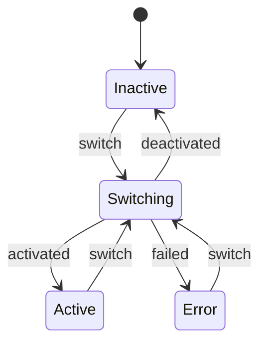
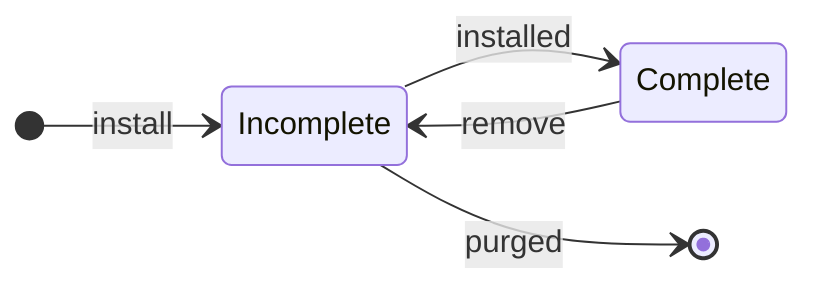

# Reference

This page documents the technical internals of Rugix Apps: app and generation state machines, storage layout, bundle format, systemd integration, crash recovery, and the CLI reference.

## App State Machine

An app is always in one of the following states:



Activation, deactivation, and generation switches are all represented by the `Switching` state, which records an optional `from` generation (to deactivate) and an optional `to` generation (to activate). The `from` generation is deactivated first, then the `to` generation is activated. If activation fails and a `from` generation is available, rollback to that generation is attempted automatically (by activating the `from` generation again). If rollback also fails, the app enters the `Error` state and requires manual intervention.

If the system crashes while in the `Switching` state, [crash recovery](#crash-recovery) retries the switch forward on the next boot.

## Generation State Machine

A generation is either **incomplete** or **complete**. When a bundle is installed, a new generation is created in the incomplete state. Once all files have been fully extracted, it transitions to complete. To remove a generation, it is first marked incomplete again and then its files are deleted.



Incomplete generations are always safe to purge, whether they result from an interrupted installation or an interrupted removal.

On the filesystem, each generation is a numbered subdirectory under `<app>/generations/`. The complete/incomplete state is determined by the presence of a `.rugix/complete` marker file inside the generation directory.

When a generation is successfully activated, the `lastActivated` timestamp in `.rugix/generation.json` is updated. Rollback only considers generations that have been activated at least once, ensuring it never targets a generation that was installed but never activated.

## Storage Layout

App data is stored in the Rugix state directory at `/run/rugix/state/apps/` (or `/var/lib/rugix/apps/` if Rugix state management is not active). Using the state directory ensures that a factory reset also clears installed apps and their data. Each app has the following directory structure:

```
<apps-dir>/<app>/
├── .rugix/
│   └── state.json                   # app lifecycle state
├── generations/
│   ├── 1/                            # old generation
│   │   ├── app.toml
│   │   ├── ...
│   │   └── .rugix/
│   │       ├── generation.json       # metadata (number, timestamps)
│   │       └── complete              # marker: fully installed
│   ├── 2/                            # another old generation
│   └── 3/                            # current generation
│       ├── app.toml
│       ├── docker-compose.yml
│       ├── images/
│       │   └── myimage.tar
│       └── .rugix/
│           ├── generation.json
│           └── complete
├── data/                             # persistent app data (survives generations)
└── systemd/
    └── units/                        # rendered systemd units
        └── ...
```

Key aspects:

- **Persistent data directory.** The `data/` directory is shared across all generations. It is the right place for databases, caches, or any state that should survive app updates.
- **Complete marker.** The `.rugix/complete` file is written only after all payloads for a generation have been fully extracted. Its absence means the generation is incomplete.
- **Generation metadata.** The `.rugix/generation.json` file stores the generation number, creation timestamp, and `lastActivated` timestamp. The `lastActivated` field is updated each time the generation is successfully activated. Rollback only considers generations where `lastActivated` is set.
- **State file.** The `.rugix/state.json` file tracks the app's lifecycle state, including intermediate states used for [crash recovery](#crash-recovery).

## App Bundles

App bundles use the same [Rugix Bundle format](../advanced/update-bundles.mdx) as system update bundles.
The difference is in the payload type: instead of slot payloads that target partitions, app bundles contain **app payloads** that populate files within a generation directory.

There are currently two app payload types:

- **`app-file`** — delivers a single file into the generation directory.
  - **`app`**: the app name.
  - **`path`**: the relative path within the generation directory where the file should be placed.
- **`app-archive`** — delivers a tar archive that is extracted into the generation directory.
  - **`app`**: the app name.

A bundle can contain multiple payloads for the same app. Payloads are applied in manifest order, and later payloads overlay earlier ones. For example, a bundle could ship a base archive followed by individual file payloads that override specific configuration files.

**`app-file`** payloads are ideal for large artifacts (Docker image tarballs, binaries) because they leverage the bundle format's support for compression, block-level deduplication, and delta encoding.
**`app-archive`** payloads are convenient for delivering many small files at once (configuration, scripts, templates) without the overhead of a separate payload per file.

## Systemd Integration

Orchestrators that use systemd (such as `binary`) persist rendered unit files under `<app>/systemd/units/` in the app directory. This allows units to survive across generations and be restored after a reboot.

**Runtime installation.** When a generation is activated, the rendered systemd unit is written to two locations:

1. **`<app>/systemd/units/`** in the app directory. This copy persists across reboots.
2. **`/run/systemd/system/`**, the systemd runtime directory, for immediate availability.

A `daemon-reload` is triggered so systemd picks up the new unit.

**Boot-time restoration.** Since `/run/` is a tmpfs and its contents do not survive reboots, a oneshot service is needed to restore the units on boot:

```ini title="rugix-app-sync.service"
[Unit]
Description=Sync Rugix app units into systemd
After=local-fs.target
DefaultDependencies=no

[Service]
Type=oneshot
ExecStart=rugix-ctrl apps systemd sync-units
RemainAfterExit=yes

[Install]
WantedBy=multi-user.target
```

The `rugix-ctrl apps systemd sync-units` command copies persisted unit files for all **active** apps into `/run/systemd/system/` and triggers a `daemon-reload`. Apps that are not in the active state are skipped.
This service should be enabled on systems that use systemd as the service manager.

## Crash Recovery

Activating and deactivating a generation involves multiple steps (running orchestrator hooks, updating state, cleaning up resources).
If the system loses power or crashes mid-transition, these operations could be left in an inconsistent state.

To handle this, Rugix Apps tracks the app's lifecycle state in `<app_dir>/.rugix/state.json`.
The state is updated _before_ a transition begins and again _after_ it completes.
If the system comes back up and the state is still intermediate, recovery replays the operation.

The state file records one of:

- **`inactive`**: no generation is active.
- **`switching`**: a transition is in progress. Records an optional `from` generation (being deactivated) and an optional `to` generation (being activated).
- **`active`**: a generation is active and ready to run.
- **`error`**: a transition and automatic rollback both failed. Records the generation that failed and an error message. Manual intervention is required.

If the system crashes while in the `switching` state, recovery retries the switch forward. If a switch _fails_ (returns an error rather than being interrupted), the previous generation is automatically rolled back. If rollback also fails, the app transitions to the `error` state.

**Automatic recovery** should be run via a separate boot service that starts late enough for all required dependencies (Docker daemon, network, etc.) to be available:

```ini title="rugix-app-recover.service"
[Unit]
Description=Recover interrupted Rugix app transitions
After=network.target docker.service

[Service]
Type=oneshot
ExecStart=rugix-ctrl apps recover

[Install]
WantedBy=multi-user.target
```

The `rugix-ctrl apps recover` command can also be called manually at any time.

## CLI Reference

| Command                                       | Description                                   |
| --------------------------------------------- | --------------------------------------------- |
| `rugix-ctrl apps install <bundle>`            | Install apps from a bundle.                   |
| `rugix-ctrl apps list`                        | List all installed apps with status.          |
| `rugix-ctrl apps info <app>`                  | Show details for an app.                      |
| `rugix-ctrl apps activate <app> [generation]` | Activate a generation (starts the app).       |
| `rugix-ctrl apps deactivate <app>`            | Deactivate the current generation (stops it). |
| `rugix-ctrl apps rollback <app>`              | Roll back to the previous generation.         |
| `rugix-ctrl apps remove <app>`                | Remove an app entirely.                       |
| `rugix-ctrl apps generations <app>`           | List all generations.                         |
| `rugix-ctrl apps gc [app] [--keep N]`         | Garbage collect old generations.              |
| `rugix-ctrl apps recover`                     | Recover interrupted transitions for all apps. |
| `rugix-ctrl apps systemd sync-units`          | Sync persisted units into systemd (for boot). |
