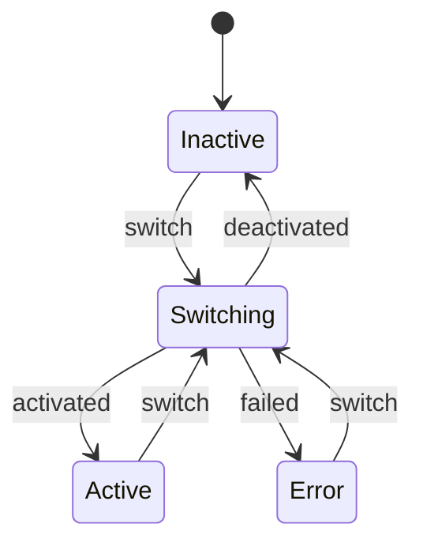
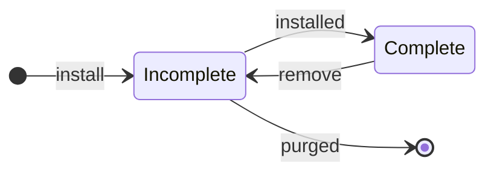

# Rugix Apps

:::warning
Rugix Apps is an **experimental feature**. Its interface may change in future releases without notice.
:::

Rugix Apps is a mechanism for deploying and managing application workloads on embedded devices.
While Rugix Ctrl's core OTA update mechanism typically operates at the _system_ level, replacing entire root filesystem partitions, Rugix Apps operates at the _application_ level, allowing individual applications to be installed, updated, rolled back, and removed independently of system updates.

## Concepts

### Apps

An **app** is a named, self-contained application workload managed by Rugix Ctrl.
Each app has:

- A **name** that serves as its unique identifier (e.g., `my-service`, `monitoring-agent`).
- A series of **generations** representing successive installed versions.
- A **data directory** for persistent state that survives across generations.

Multiple independent apps can coexist on the same device, each with its own lifecycle.

An app is always in one of the following states:



Activation, deactivation, and generation switches are all represented by the `Switching` state, which records an optional `from` generation (to deactivate) and an optional `to` generation (to activate). The `from` generation is deactivated first, then the `to` generation is activated. If activation fails and a `from` generation is available, rollback to that generation is attempted automatically (by activating the `from` generation again). If rollback also fails, the app enters the `Error` state and requires manual intervention.

If the system crashes while in the `Switching` state, [crash recovery](#crash-recovery) retries the switch forward on the next boot.

### Generations

A **generation** is an immutable, numbered snapshot of an app's files.
When a new version of an app is installed, it creates a new generation. The existing generations remain untouched. This enables instant rollback to a previous generation without re-downloading anything.

A generation is either **incomplete** or **complete**. When a bundle is installed, a new generation is created in the incomplete state. Once all files have been fully extracted, it transitions to complete.

To remove a generation, it is first marked incomplete again and then its files are deleted. If deletion is interrupted, the generation remains incomplete. Incomplete generations are always safe to purge (remove their files), whether they result from an interrupted installation or an interrupted removal.

On the filesystem, each generation is a numbered subdirectory under `<app>/generations/`. The complete/incomplete state is determined by the presence of a `.rugix/complete` marker file inside the generation directory. When the marker is present, the generation is complete; when it is absent, the generation is incomplete.

When a generation is successfully activated, the `lastActivated` timestamp in `.rugix/generation.json` is updated. Rollback only considers generations that have been activated at least once, ensuring it never targets a generation that was installed but never activated.



### Orchestrators

An **orchestrator** is a backend that knows how to manage the lifecycle of a particular kind of workload.
The orchestrator for an app is declared in its [manifest](#app-manifest).
Rugix Apps ships with the following built-in orchestrators:

| Orchestrator                        | Description                                          |
| ----------------------------------- | ---------------------------------------------------- |
| [`docker-compose`](#docker-compose) | Manages containers defined by a Docker Compose file. |
| [`binary`](#binary)                 | Manages a single executable via a service manager.   |
| [`generic`](#generic)               | Delegates to user-provided shell scripts.            |

#### Orchestrator Interface

Every orchestrator implements three lifecycle operations.

| Operation      | Purpose                                                                                            |
| -------------- | -------------------------------------------------------------------------------------------------- |
| **activate**   | Set up resources, start the workload, and register auto-start behaviour so the app starts on boot. |
| **status**     | Query the workload's status: running, stopped, failed, or unknown.                               |
| **deactivate** | Stop the workload, disable auto-start, and tear down resources.                                    |

Each operation receives a **context** containing:

| Field            | Description                                                                          |
| ---------------- | ------------------------------------------------------------------------------------ |
| `NAME`           | The app name.                                                                        |
| `APP_DIR`        | Absolute path to the app directory.                                                  |
| `GENERATION_DIR` | Absolute path to the generation directory.                                           |
| `DATA_DIR`       | Absolute path to the app's persistent data directory.                                |
| `RECOVERY`       | `true` if this invocation is replaying an interrupted transition; `false` otherwise. |

How this context is surfaced depends on the orchestrator.
The built-in orchestrators use it internally; the `generic` orchestrator exposes it as environment variables (prefixed with `RUGIX_APP_`).

#### Service Manager

Some orchestrators need an external **service manager** (init system) to supervise processes. Others manage processes themselves and do not require one. The service manager is a system-level setting configured in `/etc/rugix/apps.toml`:

```toml title="/etc/rugix/apps.toml"
service-manager = "systemd"
```

If the file is absent or the field is omitted, Rugix Apps attempts auto-detection by probing the system (e.g., checking for `/run/systemd/system`). If no known service manager is detected, it defaults to `"none"`. The effective value is passed to every orchestrator. Orchestrators that require a specific service manager validate the value and report an error if it is unsupported.

### App Manifest

Every generation must contain an **app manifest** at `app.toml` in its root directory.
The manifest declares which orchestrator to use:

```toml title="app.toml"
orchestrator = "generic"
```

Each orchestrator expects specific files in the generation directory (e.g., `docker-compose.yml`, `systemd.service`, `orchestrator`). See the built-in orchestrator sections below for details.

## Built-in Orchestrators

### Docker Compose

The `docker-compose` orchestrator manages a set of containers defined by a Docker Compose file.
It interacts directly with the Docker daemon and does not integrate with a service manager.

```toml title="app.toml"
orchestrator = "docker-compose"
```

The generation directory must contain a `docker-compose.yml` file. It may also contain:

- An `images/` directory with Docker image tarballs (`.tar` files) that are loaded with `docker image load`.

**Lifecycle operations:**

| Operation  | Implementation                                                                              |
| ---------- | ------------------------------------------------------------------------------------------- |
| activate   | Loads all images, then runs `docker compose up -d`.                                         |
| status     | Checks `docker compose ps --format json` output.                                            |
| deactivate | Runs `docker compose down`.                                                                  |

### Binary

The `binary` orchestrator manages a single executable via a systemd service unit.

```toml title="app.toml"
orchestrator = "binary"
```

The generation directory must contain a `systemd.service` unit template. The template supports the following placeholders:

| Placeholder         | Replaced with                                         |
| ------------------- | ----------------------------------------------------- |
| `${GENERATION_DIR}` | Absolute path to the generation directory.             |
| `${DATA_DIR}`       | Absolute path to the app's persistent data directory. |

Example unit template:

```ini title="systemd.service"
[Unit]
Description=My Server

[Service]
ExecStart=${GENERATION_DIR}/my-server
WorkingDirectory=${DATA_DIR}
Restart=on-failure
```

**Lifecycle operations:**

| Operation  | Implementation                                                                                                                                               |
| ---------- | ------------------------------------------------------------------------------------------------------------------------------------------------------------ |
| activate   | Renders the unit template, writes it to the app's `systemd/units` directory and `/run/systemd/system/`, runs `daemon-reload`, then `systemctl enable --now`. |
| status     | Maps `systemctl is-active` output to running/stopped/failed/unknown.                                                                                       |
| deactivate | Runs `systemctl disable --now`, removes the rendered unit files, runs `daemon-reload`.                                                                       |

See [Systemd Integration](#systemd-integration) for details on boot-time unit restoration.

### Generic

The `generic` orchestrator delegates all lifecycle operations to an `orchestrator` script.
This is the most flexible orchestrator and can manage any kind of workload.

```toml title="app.toml"
orchestrator = "generic"
```

The generation directory must contain an `orchestrator` script. It is invoked with the operation name as the first argument (`activate`, `status`, `deactivate`). The working directory is set to the generation directory.

The following environment variables are set:

| Variable                   | Description                                                           |
| -------------------------- | --------------------------------------------------------------------- |
| `RUGIX_APP_NAME`           | The app name.                                                         |
| `RUGIX_APP_DIR`            | Absolute path to the app directory.                                   |
| `RUGIX_APP_GENERATION_DIR` | Absolute path to the generation directory.                            |
| `RUGIX_APP_DATA_DIR`       | Absolute path to the app's persistent data directory.                 |
| `RUGIX_APP_RECOVERY`       | `"true"` if replaying an interrupted transition, `"false"` otherwise. |

For all operations except `status`, a zero exit code means success and non-zero means failure (stderr is included in the error message). The `status` operation must print a JSON object to stdout:

```json
{"status": "running"}
{"status": "stopped"}
{"status": "failed", "message": "health check failing"}
{"status": "unknown"}
```

If the orchestrator script exits with a non-zero status or produces invalid JSON, the status is reported as unknown.

**Example:** A generic app that manages a background process using a PID file:

```bash title="orchestrator"
#!/bin/sh
set -eu

PID_FILE="$RUGIX_APP_DATA_DIR/daemon.pid"

case "$1" in
  activate)
    # Start the daemon.
    nohup "$RUGIX_APP_GENERATION_DIR/my-daemon" \
        --data-dir "$RUGIX_APP_DATA_DIR" \
        --pid-file "$PID_FILE" \
        > "$RUGIX_APP_DATA_DIR/daemon.log" 2>&1 &
    ;;
  status)
    if [ -f "$PID_FILE" ] && kill -0 "$(cat "$PID_FILE")" 2>/dev/null; then
        echo '{"status": "running"}'
    else
        echo '{"status": "stopped"}'
    fi
    ;;
  deactivate)
    # Stop the daemon.
    if [ -f "$PID_FILE" ]; then
        kill "$(cat "$PID_FILE")" 2>/dev/null
        rm -f "$PID_FILE"
    fi
    ;;
esac
```

## Lifecycle

### Installing an App

Apps are installed from app bundles using:

```shell
rugix-ctrl apps install <bundle>
```

This command:

1. **Extracts** the app payloads in the bundle into a new generation directory for each app.
2. **Marks** each generation as complete.
3. **Activates** each generation (runs the orchestrator's **activate** operation, which also starts the app and registers auto-start behaviour).

A single bundle can contain payloads for multiple apps.
Each app's payloads are grouped into a separate generation.

### Activating and Deactivating

Activation prepares a generation for use, starts the workload, and registers auto-start behaviour (e.g., `systemctl enable`) so the app starts automatically on boot.

```shell
# Activate a specific generation:
rugix-ctrl apps activate <app> <generation>

# Re-activate the most recently activated generation:
rugix-ctrl apps activate <app>

# Deactivate the current generation:
rugix-ctrl apps deactivate <app>
```

If another generation is currently active, it is automatically deactivated first.
Deactivation stops the workload, disables auto-start, and tears down orchestrator resources.

### Rollback

To roll back to the previous generation:

```shell
rugix-ctrl apps rollback <app>
```

This deactivates the current generation and activates the most recent previously-activated generation.

### Removing an App

To remove an app entirely, including all generations and persistent data:

```shell
rugix-ctrl apps remove <app>
```

This deactivates the current generation before deleting the app directory.

### Garbage Collection

Over time, old generations accumulate on disk.
To clean them up:

```shell
# Garbage collect all apps (keep the last activated generation by default):
rugix-ctrl apps gc

# Garbage collect a specific app:
rugix-ctrl apps gc <app>

# Keep more previously activated generations:
rugix-ctrl apps gc --keep 3
```

Generations that were never activated are always removed, since they are not valid rollback targets. Among previously activated generations, the `--keep` most recent ones are retained (default: 1). The currently active generation is always kept in addition to the `--keep` count.

## Inspecting Apps

All inspection commands produce structured JSON output.

```shell
# List all apps with their status and current generation:
rugix-ctrl apps list

# Show details for a specific app (including all generations):
rugix-ctrl apps info <app>

# List all generations for an app:
rugix-ctrl apps generations <app>
```

Each generation in the output includes the following fields:

- **`current`**: whether this is the currently active generation.
- **`complete`**: whether the generation was fully installed. Incomplete generations cannot be activated and will be cleaned up by garbage collection.
- **`lastActivated`**: timestamp of the last successful activation, or `null` if never activated. Only previously activated generations are considered for rollback.

## How It Works

### Storage Layout

App data is stored in the Rugix state directory at `/run/rugix/state/apps/` (or `/var/lib/rugix/apps/` if Rugix state management is not active). Using the state directory ensures that a factory reset also clears installed apps and their data. Each app has the following directory structure:

```
<apps-dir>/<app>/
├── .rugix/
│   └── state.json                   # app lifecycle state
├── generations/
│   ├── 1/                            # old generation
│   │   ├── app.toml
│   │   ├── ...
│   │   └── .rugix/
│   │       ├── generation.json       # metadata (number, timestamps)
│   │       └── complete              # marker: fully installed
│   ├── 2/                            # another old generation
│   └── 3/                            # current generation
│       ├── app.toml
│       ├── docker-compose.yml
│       ├── images/
│       │   └── myimage.tar
│       └── .rugix/
│           ├── generation.json
│           └── complete
├── data/                             # persistent app data (survives generations)
└── systemd/
    └── units/                        # rendered systemd units
        └── ...
```

Key aspects:

- **Persistent data directory.** The `data/` directory is shared across all generations. It is the right place for databases, caches, or any state that should survive app updates.
- **Complete marker.** The `.rugix/complete` file is written only after all payloads for a generation have been fully extracted. Its absence means the generation is incomplete.
- **Generation metadata.** The `.rugix/generation.json` file stores the generation number, creation timestamp, and `lastActivated` timestamp. The `lastActivated` field is updated each time the generation is successfully activated. Rollback only considers generations where `lastActivated` is set.
- **State file.** The `.rugix/state.json` file tracks the app's lifecycle state, including intermediate states used for [crash recovery](#crash-recovery).

### App Bundles

App bundles use the same [Rugix Bundle format](../advanced/update-bundles.mdx) as system update bundles.
The difference is in the payload type: instead of slot payloads that target partitions, app bundles contain **app payloads** that populate files within a generation directory.

There are currently two app payload types:

- **`app-file`** — delivers a single file into the generation directory.
  - **`app`**: the app name.
  - **`path`**: the relative path within the generation directory where the file should be placed.
- **`app-archive`** — delivers a tar archive that is extracted into the generation directory.
  - **`app`**: the app name.

A bundle can contain multiple payloads for the same app. Payloads are applied in manifest order, and later payloads overlay earlier ones. For example, a bundle could ship a base archive followed by individual file payloads that override specific configuration files.

**`app-file`** payloads are ideal for large artifacts (Docker image tarballs, binaries) because they leverage the bundle format's support for compression, block-level deduplication, and delta encoding.
**`app-archive`** payloads are convenient for delivering many small files at once (configuration, scripts, templates) without the overhead of a separate payload per file.

### Systemd Integration

Orchestrators that use systemd (such as `binary`) persist rendered unit files under `<app>/systemd/units/` in the app directory. This allows units to survive across generations and be restored after a reboot.

**Runtime installation.** When a generation is activated, the rendered systemd unit is written to two locations:

1. **`<app>/systemd/units/`** in the app directory. This copy persists across reboots.
2. **`/run/systemd/system/`**, the systemd runtime directory, for immediate availability.

A `daemon-reload` is triggered so systemd picks up the new unit.

**Boot-time restoration.** Since `/run/` is a tmpfs and its contents do not survive reboots, a oneshot service is needed to restore the units on boot:

```ini title="rugix-app-sync.service"
[Unit]
Description=Sync Rugix app units into systemd
After=local-fs.target
DefaultDependencies=no

[Service]
Type=oneshot
ExecStart=rugix-ctrl apps systemd sync-units
RemainAfterExit=yes

[Install]
WantedBy=multi-user.target
```

The `rugix-ctrl apps systemd sync-units` command copies persisted unit files for all **active** apps into `/run/systemd/system/` and triggers a `daemon-reload`. Apps that are not in the active state are skipped.
This service should be enabled on systems that use systemd as the service manager.

### Crash Recovery

Activating and deactivating a generation involves multiple steps (running orchestrator hooks, updating state, cleaning up resources).
If the system loses power or crashes mid-transition, these operations could be left in an inconsistent state.

To handle this, Rugix Apps tracks the app's lifecycle state in `<app_dir>/.rugix/state.json`.
The state is updated _before_ a transition begins and again _after_ it completes.
If the system comes back up and the state is still intermediate, recovery replays the operation.

The state file records one of:

- **`inactive`**: no generation is active.
- **`switching`**: a transition is in progress. Records an optional `from` generation (being deactivated) and an optional `to` generation (being activated).
- **`active`**: a generation is active and ready to run.
- **`error`**: a transition and automatic rollback both failed. Records the generation that failed and an error message. Manual intervention is required.

If the system crashes while in the `switching` state, recovery retries the switch forward. If a switch _fails_ (returns an error rather than being interrupted), the previous generation is automatically rolled back. If rollback also fails, the app transitions to the `error` state.

**Automatic recovery** should be run via a separate boot service that starts late enough for all required dependencies (Docker daemon, network, etc.) to be available:

```ini title="rugix-app-recover.service"
[Unit]
Description=Recover interrupted Rugix app transitions
After=network.target docker.service

[Service]
Type=oneshot
ExecStart=rugix-ctrl apps recover

[Install]
WantedBy=multi-user.target
```

The `rugix-ctrl apps recover` command can also be called manually at any time.

When an orchestrator operation is re-run during recovery, the context includes a **recovery flag**.
For the `generic` orchestrator, this is surfaced as the `RUGIX_APP_RECOVERY` environment variable (set to `"true"`).
Scripts should be written to be **idempotent** and handle being called again after a partial execution without side effects.
The recovery flag allows scripts to take a different code path if needed (e.g., skipping a step that is known to have completed, or cleaning up partial state before retrying).

## CLI Reference

| Command                                       | Description                                   |
| --------------------------------------------- | --------------------------------------------- |
| `rugix-ctrl apps install <bundle>`            | Install apps from a bundle.                   |
| `rugix-ctrl apps list`                        | List all installed apps with status.          |
| `rugix-ctrl apps info <app>`                  | Show details for an app.                      |
| `rugix-ctrl apps activate <app> [generation]`  | Activate a generation (starts the app).       |
| `rugix-ctrl apps deactivate <app>`            | Deactivate the current generation (stops it). |
| `rugix-ctrl apps rollback <app>`              | Roll back to the previous generation.         |
| `rugix-ctrl apps remove <app>`                | Remove an app entirely.                       |
| `rugix-ctrl apps generations <app>`           | List all generations.                         |
| `rugix-ctrl apps gc [app] [--keep N]`          | Garbage collect old generations.              |
| `rugix-ctrl apps recover`                     | Recover interrupted transitions for all apps. |
| `rugix-ctrl apps systemd sync-units`          | Sync persisted units into systemd (for boot). |
